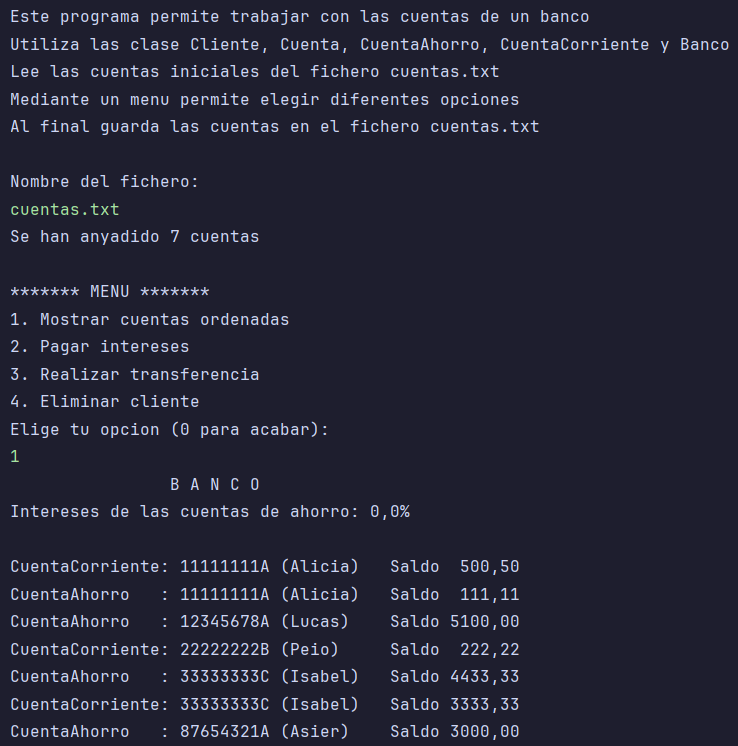
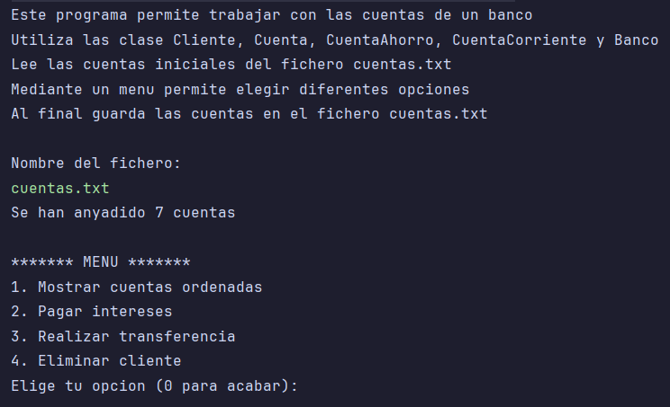
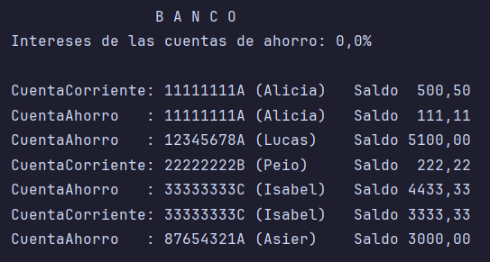
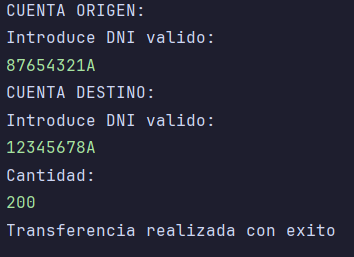
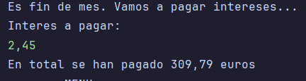

# Sistema de Gestión Bancaria en Java

Este proyecto implementa un sistema de gestión bancaria en Java que permite administrar diferentes tipos de cuentas (ahorro y corriente), realizar transferencias, pagar intereses y gestionar clientes.



## Estructura del Proyecto

El sistema está compuesto por las siguientes clases:

- **Cliente**: Representa a un cliente del banco con DNI y nombre.
- **Cuenta**: Clase abstracta que define la estructura básica de una cuenta bancaria.
- **CuentaAhorro**: Cuenta con intereses y saldo mínimo requerido.
- **CuentaCorriente**: Cuenta con número limitado de retiradas sin comisión.
- **Banco**: Gestiona la colección de cuentas y operaciones entre ellas.
- **BancoMain**: Contiene el programa principal y la interfaz de usuario.

## Características Principales

### Tipos de Cuentas

- **Cuenta de Ahorro**:
  - Mantiene un saldo mínimo de 10€
  - Bonus de 100€ para depósitos iniciales mayores a 3000€
  - Comisión fija de 2€ por cada retirada
  - Acumula intereses

- **Cuenta Corriente**:
  - Tres primeras retiradas mensuales sin comisión
  - Comisión de 2€ a partir de la cuarta retirada
  - Comisión fija de 1€ por cada ingreso
  - No acumula intereses

### Funcionalidades del Sistema

1. **Gestión de Cuentas**:
   - Creación de distintos tipos de cuentas
   - Ordenación de cuentas por DNI y saldo
   - Búsqueda de cuentas por DNI

2. **Operaciones Bancarias**:
   - Ingresos y retiradas con reglas específicas para cada tipo de cuenta
   - Transferencias entre cuentas
   - Cálculo y pago de intereses para cuentas de ahorro
   - Reseteo mensual del contador de retiradas para cuentas corrientes

3. **Gestión de Clientes**:
   - Eliminación de todas las cuentas asociadas a un cliente

## Cómo Usar el Programa

### Requisitos
- Java JDK 8 o superior

### Ejecución
1. Compile los archivos `.java` del proyecto:
   ```
   javac *.java
   ```

2. Ejecute la clase principal:
   ```
   java BancoMain
   ```

3. Cuando se solicite, introduzca el nombre del archivo que contiene las cuentas (por defecto: `cuentas.txt`).

### Formato del Archivo de Cuentas
El archivo debe seguir el siguiente formato:
```
DNI NombreCliente SaldoInicial TipoCuenta
```
Donde:
- `DNI`: 8 dígitos seguidos de una letra mayúscula
- `NombreCliente`: Nombre del titular de la cuenta
- `SaldoInicial`: Cantidad inicial en la cuenta
- `TipoCuenta`: 'A' para Cuenta de Ahorro, 'C' para Cuenta Corriente

Ejemplo:
```
12345678A Alice 1000.50 C
```

### Menú de Opciones
El programa muestra un menú con las siguientes opciones:
1. **Mostrar cuentas ordenadas**: Muestra todas las cuentas ordenadas por DNI y saldo.
2. **Pagar intereses**: Aplica intereses a las cuentas de ahorro y resetea el contador de retiradas de cuentas corrientes.
3. **Realizar transferencia**: Permite transferir dinero entre cuentas.
4. **Eliminar cliente**: Elimina todas las cuentas asociadas a un cliente.
0. **Fin del programa**: Termina la ejecución.

## Capturas de Pantalla

A continuación se muestran capturas de pantalla de las principales funcionalidades del sistema:

### Menú Principal

*Interfaz del menú principal con las opciones disponibles*

### Listado de Cuentas

*Visualización de cuentas ordenadas por DNI y saldo*

### Proceso de Transferencia

*Proceso de transferencia entre cuentas*

### Pago de Intereses

*Proceso de pago de intereses y reseteo mensual*

## Ejemplo de Salida

Al ejecutar la opción "Mostrar cuentas ordenadas", verá algo como:

```
                      B A N C O
Intereses de las cuentas de ahorro: 5.0% 

CuentaAhorro    : 11111111A (Alicia)    Saldo  111.11
CuentaCorriente : 11111111A (Alicia)    Saldo  500.50
CuentaAhorro    : 12345678A (Lucas)     Saldo 5000.00
CuentaCorriente : 22222222B (Peio)      Saldo  222.22
CuentaCorriente : 33333333C (Isabel)    Saldo 3333.33
CuentaAhorro    : 33333333C (Isabel)    Saldo 4333.33
CuentaAhorro    : 87654321A (Asier)     Saldo 3000.00
```

## Reglas de Negocio Implementadas

1. Dos clientes son iguales si coinciden DNI y nombre.
2. Las cuentas se ordenan primero por DNI y luego por saldo (mayor a menor).
3. Los intereses se aplican solo a las cuentas de ahorro.
4. Las retiradas en cuentas de ahorro requieren mantener un saldo mínimo de 10€.
5. Las cuentas corrientes tienen un límite de 3 retiradas sin comisión por mes.

## Diagrama de Clases

```
                        +----------------+
                        |    Cliente     |
                        +----------------+
                        | -dni: String   |
                        | -nombre: String|
                        +----------------+
                                ^
                                |
                        +----------------+
                        |     Cuenta     |
                        +----------------+
                        | #titular: Cliente |
                        | #saldo: double   |
                        +----------------+
                                ^
                                |
            +-------------------+-------------------+
            |                                       |
  +----------------+                      +----------------+
  |  CuentaAhorro  |                      | CuentaCorriente|
  +----------------+                      +----------------+
  | +SALDO_MINIMO  |                      | +numeroRetiradas|
  | +addInteres()  |                      | +resetea()     |
  +----------------+                      +----------------+

  +----------------+
  |     Banco      |
  +----------------+
  | -cuentas: List |
  | -interesAhorro |
  +----------------+
```

## Licencia
Este proyecto está disponible como código abierto bajo la licencia MIT.
